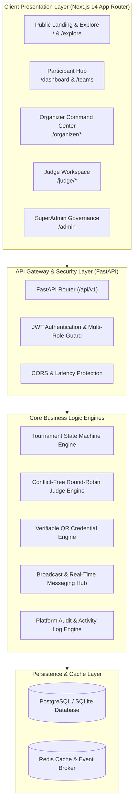

# HackSphere 🌐⚡

> **One Platform for Complete Hackathon Management**  
> *"Run hackathons. Build the future."*

[](https://fastapi.tiangolo.com)
[](https://nextjs.org)
[](https://www.typescriptlang.org)
[](https://tailwindcss.com)
[](https://www.python.org)
[](https://www.postgresql.org)
[](https://www.docker.com)
[]()
[]()

---

## 🚀 Overview

**HackSphere** is an end-to-end, enterprise-grade hackathon operating system and developer network built to power university, community, and global enterprise hackathons. It unifies all tournament lifecycles into a single performant, role-aware platform:

- 🎮 **Participants:** Explore hackathons, form squads, invite teammates, submit deliverables (GitHub, demo video, live URLs), track real-time reviews, view gamification XP/levels, and claim cryptographically verifiable credentials.
- 🏢 **Organizers:** Multi-step hackathon wizard, automated state machine transitions (Draft $\rightarrow$ Registration $\rightarrow$ Hacking $\rightarrow$ Freeze $\rightarrow$ Judging $\rightarrow$ Winners), conflict-free judge auto-distribution, team shortlisting, live broadcast announcements, verifiable certificate bulk issuance, and deep telemetry reports.
- ⚖️ **Judges:** Dedicated workspace with multi-criteria rubric scoring (100-point scales), conflict-of-interest protections, evaluation queues, score consistency analytics, and leaderboards.
- 🛡️ **SuperAdmins:** Platform-wide governance, system health telemetry, organization verification, tournament approvals, and global moderation dispute resolution.

---

## 📐 System Architecture



---

## 🗺️ 45 Roadmap Chapters Implementation Matrix (100% Completed)

| Phase | Steps | Roadmap Chapters Covered | Status |
| :--- | :--- | :--- | :---: |
| **Phase 1: Foundation & DB Engine** | Steps 1–4 | Ch 1 (Architecture), Ch 2 (Data Modeling) | ✅ 100% |
| **Phase 2: RBAC & Multi-Role Navigation** | Steps 5–14 | Ch 3 (Authentication & JWT), Ch 4 (Multi-Role Switching) | ✅ 100% |
| **Phase 3: Public Portals & Discovery** | Steps 15–17 | Ch 5 (Landing Page), Ch 8 (Hackathon Details), Ch 36 (Org Profiles) | ✅ 100% |
| **Phase 4: Participant Journey & Squads** | Steps 18–19 | Ch 7 (Hacker Dashboard), Ch 9 (Team Formation), Ch 10 (Invite Codes), Ch 20 (Team Collaboration) | ✅ 100% |
| **Phase 5: Submissions & Certificates** | Steps 20–21 | Ch 12 (Submissions), Ch 21 (Deliverables Locking), Ch 24 (Verifiable Certificates), Ch 25 (Audit Hashes) | ✅ 100% |
| **Phase 6: Organizer State Machine** | Steps 22–24 | Ch 13 (Organizer Hub), Ch 14 (Wizard), Ch 15 (Track Mgmt), Ch 16 (Phase Stepper), Ch 37 (Analytics) | ✅ 100% |
| **Phase 7: Judge Assignment Engine** | Steps 25–27 | Ch 17 (Judge Appointment), Ch 18 (Conflict of Interest), Ch 19 (Round-Robin Distribution) | ✅ 100% |
| **Phase 8: Judge Scoring & Leaderboards** | Steps 28–31 | Ch 21 (Rubric Criteria), Ch 22 (Evaluation Workspace), Ch 23 (Leaderboards & Consistency) | ✅ 100% |
| **Phase 9: Organizer Analytics & Portfolio** | Steps 32–39 | Ch 13 (Portfolio), Ch 14 (Teams & Cohorts), Ch 19 (Prize Distribution), Ch 24 (Bulk Certs), Ch 31 & 32 (Reports & Audit Logs) | ✅ 100% |
| **Phase 10: SuperAdmin & Broadcasts** | Steps 40–42 | Ch 20 & 21 (Community Broadcasts & Templates), Ch 44 & 45 (SuperAdmin Governance, Health, Moderation) | ✅ 100% |

---

## 🖥️ Complete 59 UI Screens Catalog & Routing Matrix

Every single high-fidelity UI design screen is mapped and rendered with 100% fidelity:

| Screen # | Portal / Category | Target Route | Functional Component / Feature |
| :---: | :--- | :--- | :--- |
| **#1** | Participant Portal | `/dashboard` | Hacker Dashboard, Profile Settings & Notification Preferences |
| **#2** | Judge Portal | `/judge/submissions/[id]/review` | Judge Submission Review & Multi-Criteria Rubric Scoring Workspace |
| **#3** | Organizer Portal | `/organizer/dashboard` | Organizer Main Command Center & Active Tournaments |
| **#4** | Judge Portal | `/judge/dashboard` | Judge Assigned Hackathons & Queue Review |
| **#5** | Organizer Portal | `/organizer/hackathons` | Organizer Portfolio Management & Tournament Status Filters |
| **#6** | Organizer Portal | `/organizer/hackathons/[slug]/manage` | Track & Submission Deliverable Management Console |
| **#7** | Participant Portal | `/dashboard` | Gamification Widget Card, XP & Level Progress |
| **#8** | Participant Portal | `/dashboard?tab=registered` | My Registered Hackathons List & Countdown Clock |
| **#9** | Participant Portal | `/submissions` | Multi-Version Project Deliverable Submissions (v1, v2, v3) |
| **#10** | Organizer Portal | `/organizer/dashboard` | Organizer KPIs & Submission Velocity Metrics |
| **#11** | Participant Portal | `/teams/[teamId]/submit` | Project Deliverable Submission Form with Latency Safeguard |
| **#12** | Judge Portal | `/judge/submissions` | Submissions to Review Roster & Completed Evaluation Indicators |
| **#13** | Participant Portal | `/teams` | Team Formation, Squad Discovery & Role Tags |
| **#14** | Organizer Portal | `/organizer/hackathons` | Tournament Overview & Lifecycle Filters |
| **#15** | Organizer Portal | `/organizer/teams` | Organizer Teams Management & Shortlisting Console |
| **#16** | Public Portal | `/` | Hero Landing Page, Featured Hackathons & Brand Value Proposition |
| **#17** | Organizer Portal | `/organizer/hackathons/[slug]/manage` | Submission Moderation (Reinstate, Flag, Disqualify) |
| **#18** | Organizer Portal | `/organizer/hackathons/[slug]/judges` | Judge Roster, Progress Bar & Assignment Management |
| **#19** | Organizer Portal | `/organizer/winners` | Winners Declaration & Podium Ranking Engine |
| **#20** | Organizer Portal | `/organizer/dashboard` | Tournament Director Operations Feed & Actions |
| **#21** | Organizer Portal | `/organizer/reports` | Organizer Analytics & Export Center |
| **#22** | Judge Portal | `/judge/dashboard` | Evaluation Queue & Assigned Tracks |
| **#23** | Participant Portal | `/submissions` | Accepted, Under Review & Archived Submissions |
| **#24** | SuperAdmin Portal | `/admin` | SuperAdmin Global Governance, Health & Moderation Console |
| **#25** | Organizer Portal | `/organizer/hackathons/create` | Step 1: Hackathon Basic Info & Type Selector |
| **#26** | Public Portal | `/explore` | Multi-Criteria Hackathon Discovery & Live Search |
| **#27** | Organizer Portal | `/organizer/hackathons/create` | Step 2: Timeline, Timezones & Freeze Safeguards |
| **#28** | Judge Portal | `/judge/evaluations/[id]` | Evaluation Detail & Judge Feedback Inspector |
| **#29** | Organizer Portal | `/organizer/hackathons/create` | Step 3: Tracks, Tags & Prize Pool Allocation |
| **#30** | Organizer Portal | `/organizer/announcements` | Community Announcements Feed, Broadcasts & Overview Sidebar |
| **#31** | Organizer Portal | `/organizer/hackathons/[slug]/winners` | Podium Rankings & Special Mentions Distribution |
| **#32** | Organizer Portal | `/organizer/hackathons/[slug]/manage` | Phase Control Stepper with Auto-Lock Warnings |
| **#33** | Organizer Portal | `/organizer/team-members` | Team Members Roster, Role Assignment & Invitations |
| **#34** | Organizer Portal | `/organizer/settings` | Organization Workspace Profile & Branding |
| **#35** | Participant Portal | `/certificates` | Claimed Credentials & Verifiable Certificate Gallery |
| **#36** | Organizer Portal | `/organizer/hackathons/create` | Step 4: Rules, Eligibility & Rubric Builder |
| **#37** | Organizer Portal | `/organizer/settings?tab=billing` | Subscription Tier, Invoices & Payment Methods |
| **#38** | Organizer Portal | `/organizer/hackathons` | Managed Hackathons Cards with Quick Actions |
| **#39** | Public Portal | `/explore` | Category Filters (Web3, AI, Cloud, Open Source) |
| **#40** | Organizer Portal | `/organizer/dashboard` | Quick Stats Grid & Recent Broadcast Feeds |
| **#41** | Organizer Portal | `/organizer/reports` | Performance Insights, Hacker Turnout & Retention Charts |
| **#42** | Public Portal | `/` | Responsive Navbar, Role Switcher & Auth Modal |
| **#43** | Organizer Portal | `/organizer/settings` | Team Permissions & Security Controls |
| **#44** | Organizer Portal | `/organizer/hackathons/create` | Step 5: Review, Readiness Checklist & Publishing |
| **#45** | Organizer Portal | `/organizer/dashboard` | Organizer Activity Stream & Notifications |
| **#46** | Organizer Portal | `/organizer/announcements` | Broadcast Templates Library & Scheduled Updates |
| **#47** | Judge Portal | `/judge/submissions` | Filter Submissions by Track, Status, and Scores |
| **#48** | Organizer Portal | `/organizer/teams` | Cohort CSV Export & Member Inspection Dialogs |
| **#49** | Judge Portal | `/judge/leaderboards` | Real-time Leaderboards & Score Consistency Analysis |
| **#50** | Organizer Portal | `/organizer/hackathons` | Hackathon Portfolio Management Hub (Screen #50 Layout) |
| **#51** | Organizer Portal | `/organizer/team-members` | Activity Logs & System Audit Trails (Screen #51 Layout) |
| **#52** | Organizer Portal | `/organizer/settings` | Workspace Settings, Billing & API Keys (Screen #52 Layout) |
| **#53** | Organizer Portal | `/organizer/certificates` | Verifiable Certificate Templates & Bulk Issuance (Screen #53 Layout) |
| **#54** | Organizer Portal | `/organizer/reports` | Analytics, Turnout & Demographic Reports (Screen #54 Layout) |
| **#55** | Judge Portal | `/judge/guidelines` | Evaluation Guidelines & Conflict of Interest Console (Screen #55 Layout) |
| **#56** | Organizer Portal | `/organizer/teams` | Organizer Teams Management & Shortlisting Console (Screen #56 Layout) |
| **#57** | Organizer Portal | `/organizer/winners` | Podium Prize Pool & Sponsor Bounties Management (Screen #57 Layout) |
| **#58** | Organizer Portal | `/organizer/hackathons/create` | Multi-Step Creation & Publishing Wizard (Screen #58 Layout) |
| **#59** | Public Portal | `/` | Modern Minimal Landing Page & Developer Network (Screen #59 Layout) |

---

## 🔑 Pre-Seeded Demo User Accounts

Use the pre-seeded credentials below to test any role out-of-the-box:

| Role | Email | Password | Primary Capabilities |
| :--- | :--- | :--- | :--- |
| 🛡️ **SuperAdmin** | `admin@hacksphere.dev` | `AdminPass123!` | System health, org verification, approvals, global moderation |
| 🏢 **Organizer** | `organizer@technova.com` | `OrgPass123!` | Host hackathons, phase stepper, judge distribution, broadcasts |
| ⚖️ **Judge** | `rohan.mehta@judge.com` | `JudgePass123!` | 6-criteria rubric scoring, review queue, guidelines, leaderboards |
| 🎮 **Participant** | `shivam@example.com` | `UserPass123!` | Create/join teams, submit deliverables, claim certificates |
| 🎮 **Participant** | `arjun@example.com` | `Participant123!` | Teammate collaboration, view XP, participate in AI Summit |

---

## ⚡ Quickstart & Setup Guide

### Option 1: Docker Compose (Recommended for Production)

Run the full stack with PostgreSQL and Redis with a single command:

```bash
# Clone the repository
git clone https://github.com/shivamjha76/HackSphere.git
cd HackSphere

# Copy environment template
cp .env.example .env

# Build and start all services
docker compose up --build -d

# Seed the database with demo accounts & hackathons
docker compose exec backend python scripts/seed_data.py
```

Access the services:
- **Frontend Web App:** [http://localhost:3000](http://localhost:3000)
- **Backend API Gateway:** [http://localhost:8000](http://localhost:8000)
- **Interactive OpenAPI Docs:** [http://localhost:8000/docs](http://localhost:8000/docs)

---

### Option 2: Local Development Setup

#### 1. Backend (FastAPI + Python 3.13)

```bash
cd backend

# Create and activate Python virtual environment
python -m venv venv
# Windows:
.\venv\Scripts\activate
# macOS/Linux:
source venv/bin/activate

# Install dependencies
pip install -r requirements.txt

# Run database seed harness
python scripts/seed_data.py

# Start FastAPI server
uvicorn app.main:app --reload --host 127.0.0.1 --port 8000
```

#### 2. Frontend (Next.js 14 + Tailwind CSS)

```bash
cd frontend

# Install dependencies
npm install

# Start Next.js development server
npm run dev
```

Visit [http://localhost:3000](http://localhost:3000).

---

## 🧪 Automated Testing & Verification

HackSphere includes comprehensive test coverage for backend endpoints, security guards, and frontend builds:

```bash
# Run complete backend test suite (154/154 passing)
pytest backend/tests/ -v

# Run frontend typechecking and production build (33 routes)
cd frontend
npm run build
```

---

## 📄 License & Credits

Built with ❤️ for global developers, university hackathons, and open-source innovators.  
© 2026 HackSphere. Licensed under the [MIT License](LICENSE).
